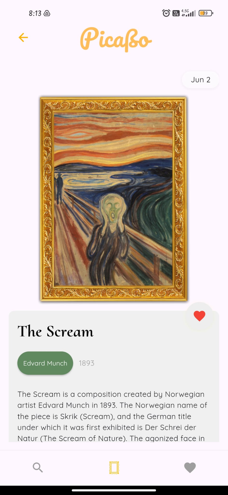
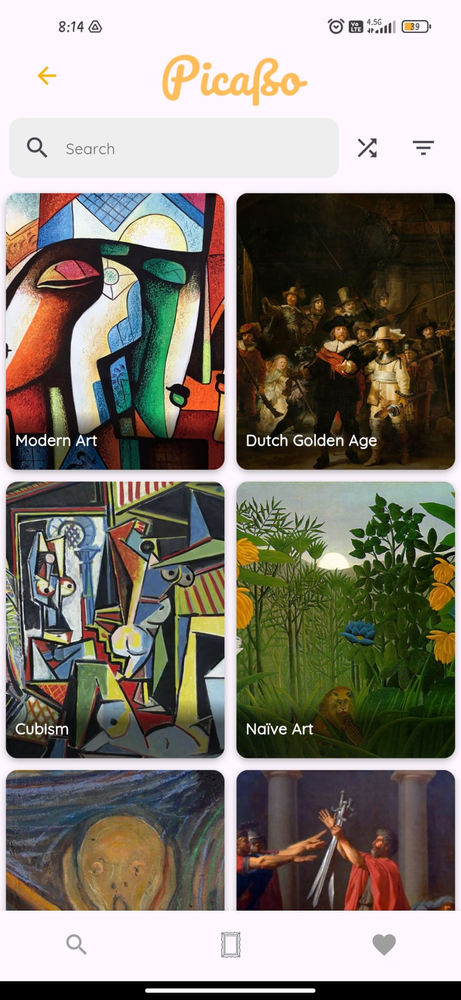
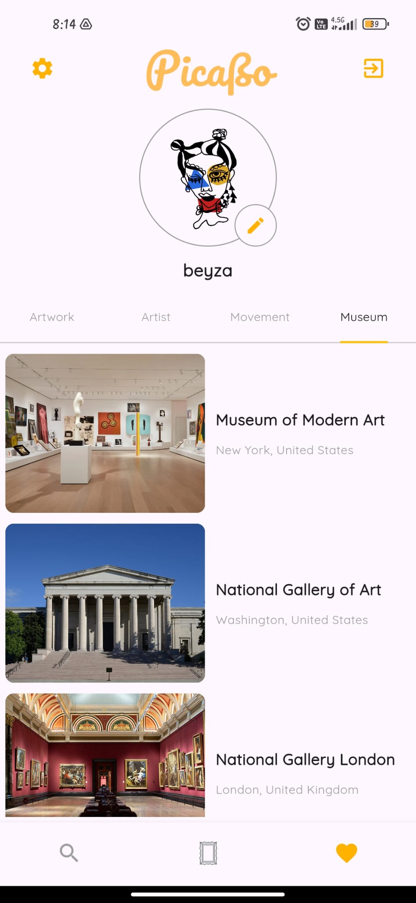
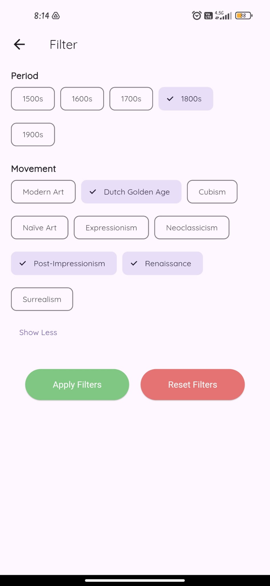

# picaßo - daily art app

## Introduction

Picaßo is an innovative mobile application designed to offer users a daily dose of inspiration through notable artworks and their compelling narratives. Our mission is to make art accessible and enjoyable for everyone, regardless of their background or expertise.

The app allows users to:

* Discover a new piece of art each day.
* Read about the story, historical context, and significance of the artwork.
* Learn about the artist of the artwork, the prominent movements and the museum where it is currently located.
* Favorite artworks, artists, movements and museums to save them for later.
* Shuffle through artworks, artists, movements and museums to explore different pieces randomly.
* Filter and search through the entire collection of them.

## Preview

<table>
  <tr>
    <td></td>
    <td></td>
  </tr>
  <tr>
    <td></td>
    <td></td>
  </tr>
</table>

## Installation

To get started with Picaßo, follow these steps:

### Prerequisites
* Flutter SDK
* Firebase account

### Steps
1. Clone the repository:

```
git clone https://github.com/your-username/picasso.git
cd picasso
```

2. Install dependencies:

```
flutter pub get
```

3. Set up Firebase
4. Run the app:

```
flutter run
```

## Usage
Once the app is up and running, you can navigate through the different sections:
  * Daily Page
  * Favorites Page
  * Discover Page

Also you can download the apk of picaßo via [this link](https://file.io/E4XmhYIByA1L).

---

Thank you for checking out Picaßo! We hope you enjoy exploring the world of art with us. For any questions or feedback, feel free to open an issue or contact us.
